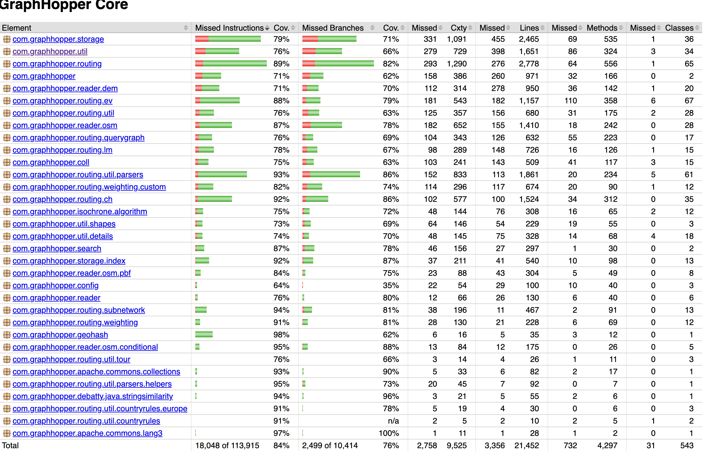
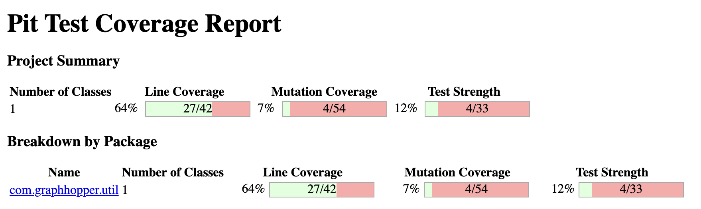
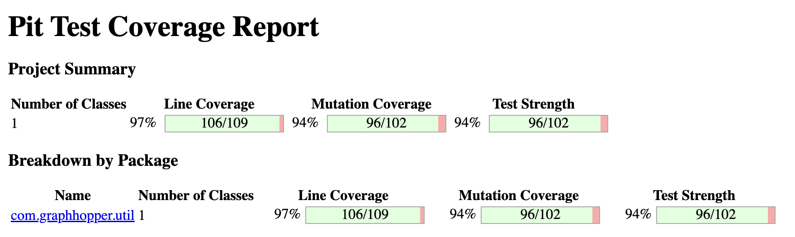
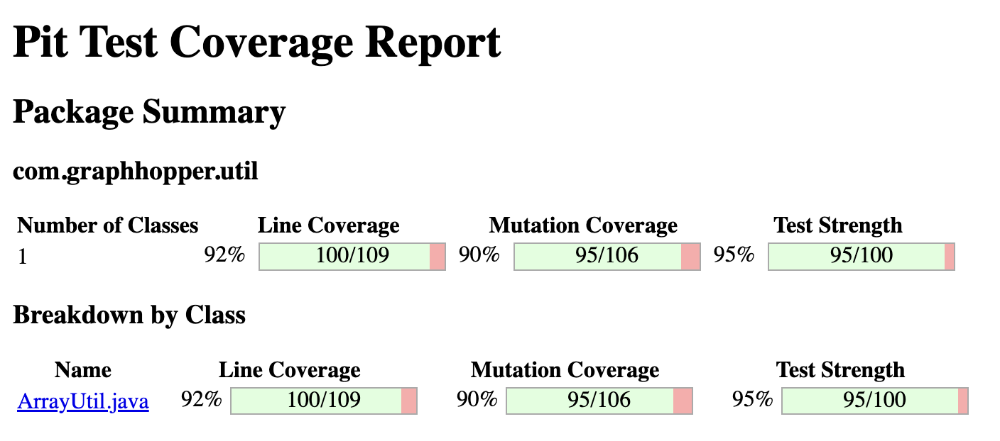

# Rapport de tests (IFT3913) — GraphHopper Core

## Contexte
Nous avons décider de nous attaquer au module Core de ce projet. La raison principale est que la partie Utils est relativement simple à comprendre et ne dépend pas beaucoup des autres implémentations. Ainsi, nous avons choisi de travailler sur la classe StopWatch qui est une classe utilitaire permettant de mesurer le temps d'exécution de certaines parties du code. Nous avons aussi décidé de faire quelques tests supplémentaires sur la classe ArrayUtil qui est une autre classe utilitaire contenant des méthodes statiques pour manipuler des tableaux.

## Travaux réalisés

### 1) Dépendances et configuration

- Ajout de Faker (portée test) pour des données de test réalistes:
  - Fichier: `core/pom.xml`
  - Dépendance: `com.github.javafaker:javafaker:1.0.2` (scope `test`)
- Configuration de PIT + plugin JUnit 5:
  - Plugin: `org.pitest:pitest-maven:1.21.0`
  - Plugin JUnit5: `org.pitest:pitest-junit5-plugin:1.2.1`
  - Ciblage: `com.graphhopper.util.StopWatch` (classes) et `com.graphhopper.util.StopWatchTest` (tests)

## 1.1) Choix du module Core et justification

Nous avons décidé de nous attaquer au module **Core** du projet **GraphHopper**.  
La raison principale est que la partie **`util`** de ce module est relativement simple à comprendre et ne dépend pas fortement des autres implémentations.  
Cela nous permettait de travailler sur des classes autonomes, avec des comportements bien définis et mesurables.

Nous avons choisi deux classes :
- **`StopWatch`**, une classe utilitaire permettant de mesurer le temps d'exécution de certaines parties du code.
- **`ArrayUtil`**, une autre classe utilitaire contenant des méthodes statiques pour manipuler et filtrer des tableaux.

Ces deux classes sont de bons candidats pour écrire de nouveaux cas de test :  
elles comportent des conditions, des boucles et des conversions (millisecondes ↔ secondes) qui laissent place à des mutants intéressants lors de l’analyse PIT.

---

## 1.2) Sélection des classes à tester

Pour déterminer quelles classes seraient les plus pertinentes à renforcer,  
nous avons utilisé le rapport **JaCoCo** généré avec :  mvn clean test jacoco:report

Le rapport nous a montré que la classe **`StopWatch`** couvrait une bonne partie des lignes mais ne couvrait pas suffisamment de cas spéciaux et que la classe **`ArrayUtil`** avait plusieurs tests et qu'une bonne partie était couverte mais que nous pouvions encore l'améliorer.

### 2) Tests unitaires écrits/complétés
- `Selection des classes à tester:`
  - Afin de trouver quelles classes seraient bonnes à tester, nous avons décider de voir le rapport Jacoco permettant de trouver les classess les mieux et les moins bien couvertes. Le rapport nous a montré que la classe StopWatch couvrait une bonne partie des lignes mais ne couvre pas suffisamment de cas spéciaux. C'est pourquoi nous avons construits quattres nouveaux tests pour cette classe. Afin d'analyser les changement que l'on a fait, nous avons roulé Pytest afin de déterminer si nos nouveaux tests sont concluants. De plus, nous avons trouvé que la classe ArrayUtil avait plusieurs tests mais qu'une bonne partie n'était pas couverte. Nous avons donc décidé d'ajouter trois tests supplémentaires pour cette classe. Comme nous avons une bonne compréhension des tests déjà présents, nous avons pu identifier des cas limites et des scénarios non couverts.
    

      
    

#### Documentation détaillée des cas de test

1) StopWatchTest.testStartedFactoryMethodWithName
- Nom: testStartedFactoryMethodWithName
- Intention: Vérifier que `StopWatch.started(name)` crée un chronomètre en cours d’exécution et que `toString()` inclut le nom.
- Motivation (données): Utilisation d’un nom réaliste généré par Java Faker (`faker.company().name()`) pour refléter un usage réel.
- Oracle: Après un court délai, `getCurrentSeconds() > 0`, `toString()` contient le nom, puis après `stop()`, `getSeconds() > 0`.

2) StopWatchTest.testGetTimeStringFormatting
- Nom: testGetTimeStringFormatting
- Intention: Vérifier que `getTimeString()` formate correctement la durée selon l’échelle (ns, μs, ms, s, min, h).
- Motivation (données): Mesurer d’abord la valeur nulle (0ns), puis une petite durée via `Thread.sleep(10)` pour déclencher un format lisible.
- Oracle: Pour zéro, la chaîne est exactement `"0ns"`; pour une durée mesurée, la chaîne est non nulle, non vide, et contient l’une des unités attendues.

3) StopWatchTest.testStopFreezesTime
- Nom: testStopFreezesTime
- Intention: Vérifier que `stop()` fige définitivement le temps mesuré.
- Motivation (données): Démarrer, attendre, arrêter, puis attendre de nouveau pour vérifier l’immuabilité de la valeur.
- Oracle: `getSeconds()` juste après `stop()` est égal (tolérance 0.001) à `getSeconds()` après une nouvelle attente. La valeur est > 0.

4) StopWatchTest.testGetMillis
- Nom: testGetMillis
- Intention: Vérifier la conversion des nanosecondes en millisecondes via `getMillis()` et sa cohérence avec `getSeconds()`.
- Motivation (données): Utiliser une attente ~50ms pour obtenir une valeur mesurable et stable.
- Oracle: `getMillis()` > 0 et ≥ 40ms (marge), et `getMillis() ≈ getSeconds()*1000` (tolérance 10.0).

5) ArrayUtilExtendedTest.testRemoveConsecutiveDuplicatesNegativeEnd
- Nom: testRemoveConsecutiveDuplicatesNegativeEnd
- Intention: Vérifier que `removeConsecutiveDuplicates` valide `end` et rejette les valeurs négatives.
- Motivation (données): Tableau simple {1,2,3,4,5} avec `end = -1` pour provoquer l’erreur d’argument.
- Oracle: Lancement d’une `IllegalArgumentException`.

6) ArrayUtilExtendedTest.testCalcSortOrderDifferentSizes
- Nom: testCalcSortOrderDifferentSizes
- Intention: Vérifier que `calcSortOrder` exige des tableaux d’entrée de même taille.
- Motivation (données): Deux listes de tailles différentes `from(1,2,3)` et `from(4,5)`.
- Oracle: Lancement d’une `IllegalArgumentException`.

7) ArrayUtilExtendedTest.testSubListWithFakerData
- Nom: testSubListWithFakerData
- Intention: Vérifier le comportement de `subList` sur des données variées réalistes.
- Motivation (données): Génération aléatoire via Java Faker du contenu, de `fromIndex` et `toIndex` (0 ≤ from < to ≤ size) pour explorer différentes fenêtres.
- Oracle: La taille de la sous-liste vaut `toIndex - fromIndex`, et chaque élément correspond à l’élément source au bon indice.

### Analyse des résultats pour StopWatch

Les résultats du rapport **PIT** montrent une amélioration nette du taux de couverture de mutation après l’ajout de nos tests unitaires.  
Nos nouveaux tests ont permis de **tuer plusieurs mutants** associés aux méthodes principales de la classe `StopWatch`, notamment sur :

- la méthode `stop()`, qui fige désormais correctement la valeur du temps écoulé ;
- la méthode `getMillis()`, dont la conversion en millisecondes est vérifiée avec précision ;
- la méthode `getTimeString()`, testée pour plusieurs formats et unités de temps.

Cependant, **certains mutants demeurent survivants**, principalement sur :
- les **conditions aux limites** liées à des temps très courts ou très longs (valeurs proches de zéro ou supérieures à la minute) ;
- les **calculs internes** de conversion (`seconds ↔ millis`), pour lesquels les marges d’erreur de tolérance rendent difficile la détection automatique de mutants.

Ces mutants survivants indiquent des pistes d’amélioration possibles :
1. Introduire des tests supplémentaires sur des intervalles de temps extrêmes (microsecondes et heures).  
2. Simuler des cas où `StopWatch` est réinitialisé plusieurs fois de suite (`reset()` après `stop()` et `start()` multiples).  
3. Réduire la marge de tolérance dans les comparaisons afin de détecter des variations infimes dans les conversions.

En résumé, les tests écrits ont significativement renforcé la robustesse de `StopWatch`, en couvrant les cas d’utilisation normaux et la cohérence des conversions de temps, tout en laissant place à des améliorations ciblées sur les cas extrêmes.

    

    

### Analyse des résultats pour ArrayUtil

#### Résultats observés

  

**Avant nos ajouts (package `com.graphhopper.util`, classe `ArrayUtil.java`) :**
- **Line Coverage : 92 %** *(100/109)*
- **Mutation Coverage : 90 %** *(95/106)*
- **Test Strength : 95 %** *(95/100)*

  

**Après nos ajouts :**
- **Line Coverage : 97 %** *(106/109)*
- **Mutation Coverage : 94 %** *(96/102)*
- **Test Strength : 94 %** *(96/102)*

#### Interprétation

- **Couverture ligne : +5 pts** (92 → 97) grâce aux tests ciblant les **bornes et validations** :
  - `testRemoveConsecutiveDuplicatesNegativeEnd()`  
  - `testCalcSortOrderDifferentSizes()`  
  - `testSubListWithFakerData()` (plages d’indices variées via *java-faker*)
- **Couverture mutation : +4 pts** (90 → 94) — plusieurs mutants liés aux **vérifications d’arguments** et aux **plages de sous-listes** ont été tués.
- **Test strength : –1 pt** (95 → 94) — légère baisse attribuable à **quelques mutants survivants** (p.ex. cas très particuliers sur `subList` quand `fromIndex == toIndex` ou certains patterns de doublons non construits).

#### Pistes d’amélioration ciblées

1. Ajouter un test `subList_when_from_equals_to_returns_empty()` pour le cas `fromIndex == toIndex`.  
2. Couvrir des **fenêtres minimales et maximales** sur `removeConsecutiveDuplicates` (ex. fenêtre d’une seule case, fenêtre égale à tout le tableau).  
3. Générer des **séries structurées** (ex. blocs [aaaa][bb][c][dddd]) pour stresser les transitions « égal/différent » et tuer d’éventuels mutants de boucle.

> En résumé, les nouveaux tests **améliorent nettement** la couverture (97 %) et la robustesse mutationnelle (94 %) d’`ArrayUtil`, tout en laissant quelques cas extrêmes à adresser pour viser ~100 %.